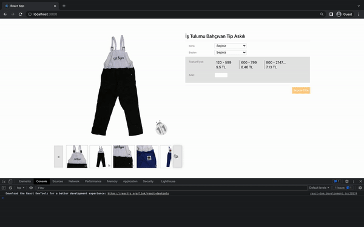

# Product Detail Page

## About Project

## The Project Usage
* On right side, you can filter images by selecting color and size.
* Enter a quantity that will be included baremlist.
* If you select color, size and enter a quantity, Sepete Ekle button will be enabled. 

## To Run Project
In the project directory, you should do these steps at below:
* ### `npm install`
* ### `npm start`

# Quick Demo

  

